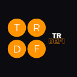
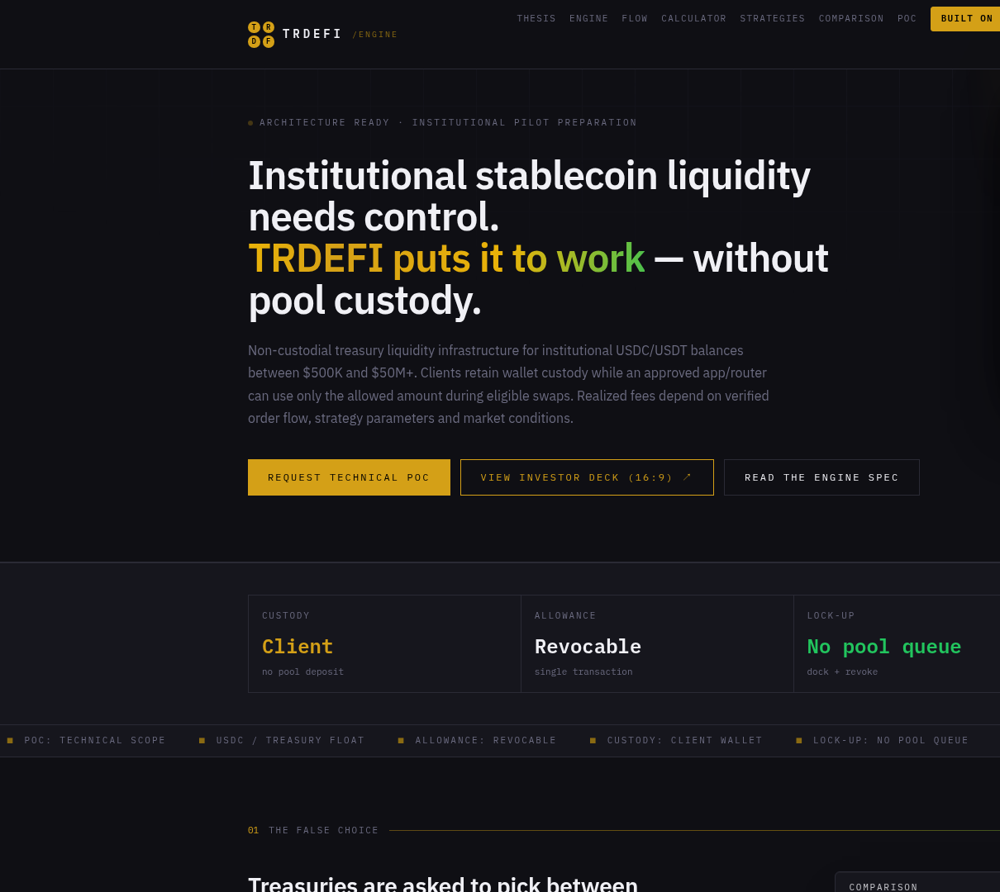
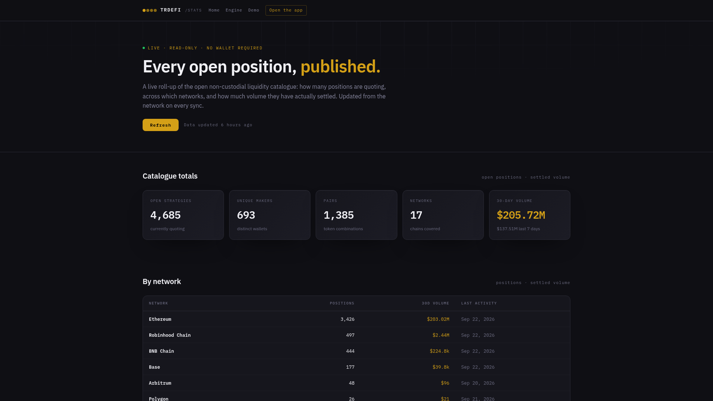
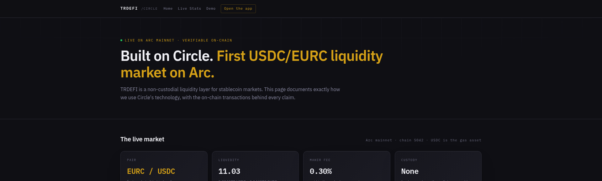

  

<h3 align="center">TRDEFI Yield — institutional treasury liquidity</h3>

  <b>Put idle stablecoin treasuries to work without giving up custody.</b> 
  No pool deposit. No lock-up. No counterparty. Funds stay in the client's own wallet,
  under a bounded and revocable allowance, with every claim verifiable on-chain.

  

---

## What it is

A **non-custodial treasury liquidity engine**. It enables institutions to earn on idle stablecoin
balances (USDC, USDT) by allocating a share of their float to on-chain shared-liquidity strategies
that earn from real trading fees.

The key property: **the tokens never leave the treasury's wallet**. The engine only receives a
revocable token allowance. The treasury keeps full control at every moment and can close a position
in a single transaction.

## Who it is for

Primary: Gulf-region fintechs, tokenisation platforms, remittance providers, payment processors,
venture studios and institutional treasury managers — organisations holding **$500K–$50M+** in
stablecoin floats that currently earn nothing while sitting idle between settlement windows,
operational needs or deployment cycles.

Secondary: crypto-native businesses with significant treasury exposure — DAOs, exchange operators
and Web3 platforms.

## The problem it solves

Treasuries holding stablecoins face a false choice: move funds into yield-generating protocols and
accept custody risk, lock-ups and counterparty exposure — or do nothing and watch the float lose
value to inflation.

TRDEFI removes the trade-off. Yield generation without depositing, without a queue and without
handing anything over.

## How it works

1. **Connect the existing wallet.** A hot wallet, a hardware wallet or a Safe multisig — whatever
   the treasury already uses for signing.
2. **Choose a strategy** from the live catalogue and allocate a percentage of the balance.
3. **Approve a bounded allowance.** The engine can use only the allowed amount, only against
   eligible swaps, and only until it is revoked.
4. **Fees settle back to the treasury wallet** as trading flow routes through the strategy.
5. **Close in one transaction** — dock the position and revoke the allowance. No withdrawal queue,
   because nothing was ever withdrawn.

The same wallet balance can back several strategies at once through virtual allocation, so the
float does not have to be split across separate pools.

## Custody and control

| Property | Value |
|---|---|
| Token custody | Client wallet, at all times |
| Treasury access granted | Bounded allowance, revocable |
| Lock-up / withdrawal queue | None |
| Exit | Single transaction (dock + revoke) |
| Counterparty exposure | None — no deposit is taken |
| Return source | Trading fees actually collected |
| Guaranteed APY | None, by design |

## Live metrics

Served live from [yield.trdefi.com/stats.html](https://yield.trdefi.com/stats.html). Every figure
corresponds to on-chain positions that can be queried independently.

| Metric | Live value |
|---|---|
| 30-day settled volume |  |
| 7-day settled volume |  |
| Open strategies |  |
| Unique makers |  |
| Pairs |  |
| Networks |  |

## Deployed on Arc

TRDEFI runs its first stablecoin market on **Arc**, Circle's USDC-native L1:

* **USDC is the gas asset** — no volatile token has to be held to transact.
* Capital is moved with Circle's cross-chain transfer protocol; **no third-party bridge** is used.
* Stablecoin-to-stablecoin conversion uses Circle's own swap tooling.

The full technical note, including the on-chain transactions behind each claim, is published at
[yield.trdefi.com/circle](https://yield.trdefi.com/circle).

## Screenshots

| Treasury view | Published catalogue | Built on Circle |
|---|---|---|
|  |  |  |

## Proof of concept

A **72-hour technical PoC**: the client sees a live, functioning engine in a test environment with
real on-chain positions and a working earning dashboard — before any commercial commitment. Scope
is agreed first, then built.

## About the source

This repository is a **product showcase**. The engine source is private; nothing here is a build
artifact, a key, or a credential. Live behaviour is at
[yield.trdefi.com](https://yield.trdefi.com).

## Changelog

### 2026-09 — Live on Arc, statistics hub, Circle integration

* First non-custodial stablecoin market shipped on **Arc mainnet**: USDC as the native gas asset,
  EURC as the paired stablecoin.
* **Built on Circle** proof page — each Circle capability documented against its on-chain
  transaction: cross-chain transfer, native USDC gas, stablecoin conversion, unified addresses.
* Public statistics hub with per-network and per-pair breakdowns, refreshed automatically.
* Public JSON roll-up at `/api/stats` and live metric badges at `/api/badge`.
* Custody model page: allowance scope, revocation path, and the exact conditions under which a
  fill can settle.
* Security pass on write paths: origin allowlist, presenter gating, per-IP rate limiting, chain
  assertions and exact-amount approvals.

### 2026-08 — Catalogue and reporting

* Live catalogue roll-up across 17 networks with 30-day settled volume per pair and per chain.
* Automated refresh every six hours, stalest rows first, never downgrading a resolved pair.
* Investor deck and technical scope documents published.

## License

All rights reserved. This repository and its contents are the property of TRDEFI Ltd. No license
is granted for reuse, redistribution or derivative works.

## Links

* **Institutional site** — https://yield.trdefi.com
* **Built on Circle** — https://yield.trdefi.com/circle
* **Statistics** — https://yield.trdefi.com/stats.html
* **Maker app** — https://app.trdefi.com
* **Company** — https://trdefi.com
